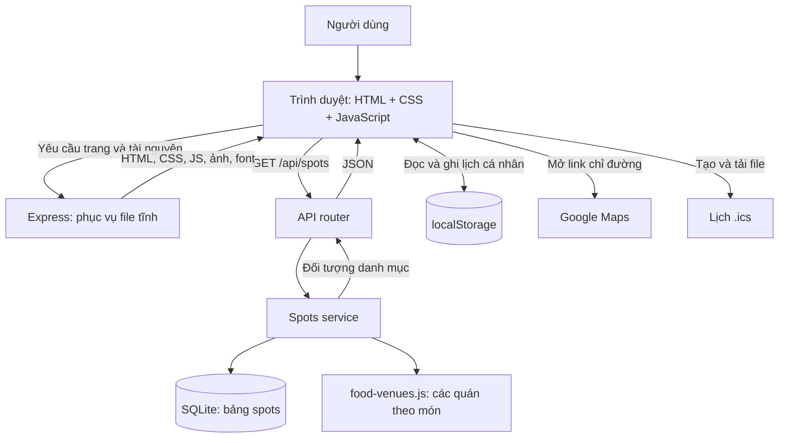
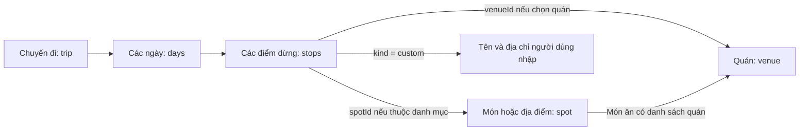
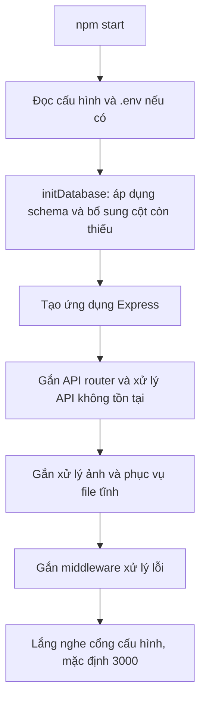
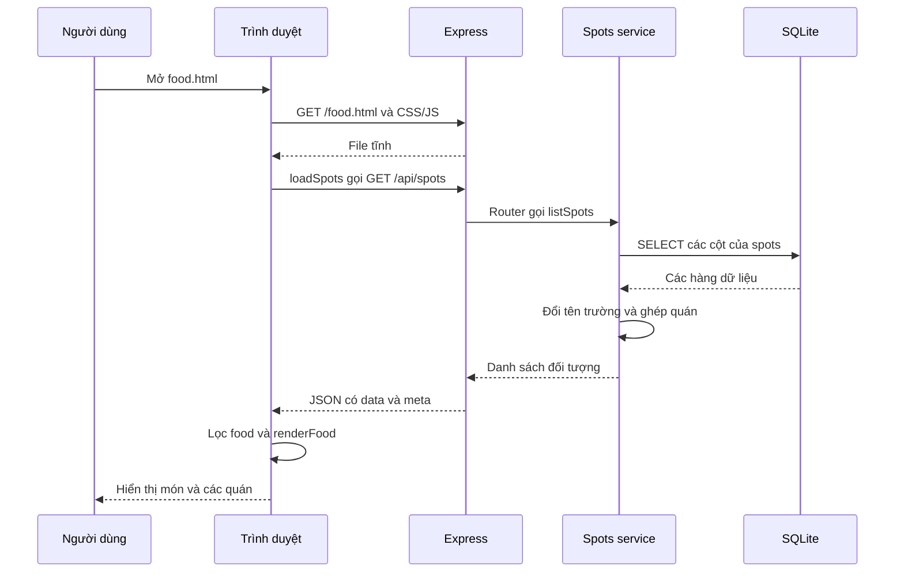
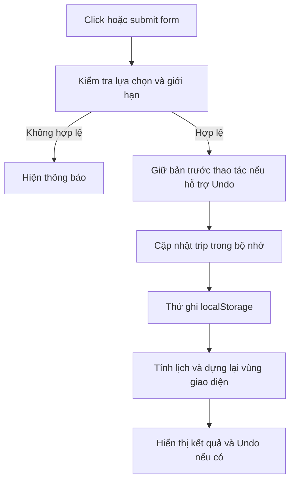
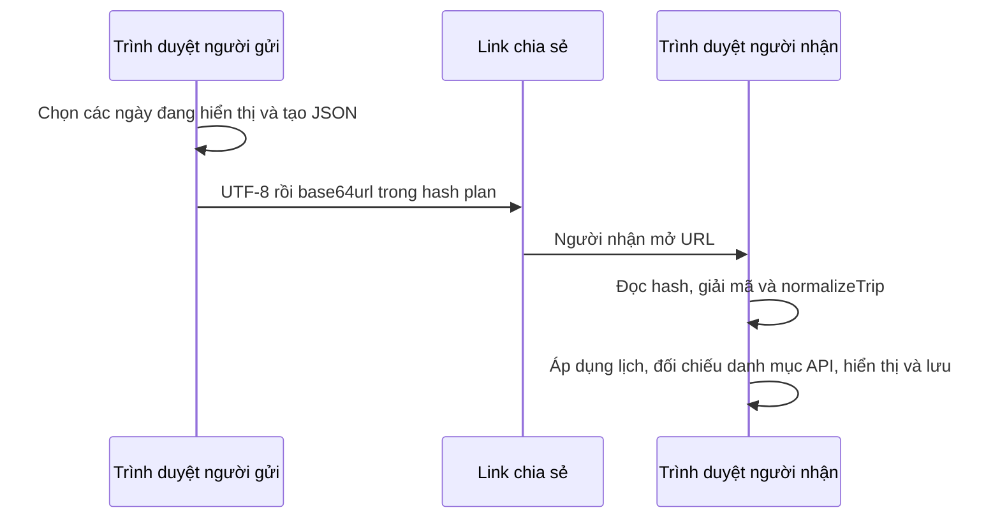

# Kiến trúc và luồng hoạt động của Hanoi Local

Tài liệu này giải thích hệ thống từ tổng thể đến từng luồng xử lý, dựa trên mã nguồn hiện tại. Có thể đọc trước [hướng dẫn thuyết trình](HUONG_DAN_THUYET_TRINH.md) để chọn thứ tự mở file khi demo.

## 1. Hệ thống giải quyết bài toán gì?

Hanoi Local giúp người dùng khám phá Hà Nội qua bốn trang:

| Trang | Nhiệm vụ |
|---|---|
| Home — `index.html` | Giới thiệu website, các tour mẫu và nội dung nổi bật. |
| Food — `food.html` | Tìm món, xem các quán, so khoảng cách và lưu món yêu thích. |
| Places — `places.html` | Tìm địa điểm, xem thời lượng tham quan và giá vé. |
| Plan — `plan.html` | Lập lịch 1–30 ngày, chỉnh điểm dừng, dùng tour, lưu và chia sẻ lịch. |

Có thể giới thiệu: **“Website kết hợp danh mục du lịch do server cung cấp với công cụ lập lịch chạy ngay trong trình duyệt. Khách có thể sử dụng mà không cần tài khoản.”**

## 2. Kiến trúc tổng thể

### 2.1. Mô hình được sử dụng

Hệ thống theo mô hình **client–server**: trình duyệt là phía khách, Express là phía máy chủ. Backend được chia thành các tầng router, service và database theo trách nhiệm.

Ứng dụng có nhiều trang HTML riêng, thường gọi là **multi-page application**. Chuyển từ Food sang Plan sẽ mở tài liệu HTML khác. Bên trong từng trang, JavaScript cập nhật nội dung động mà không cần tải lại toàn bộ trang cho mỗi thao tác.

Một tiến trình Node.js phục vụ cả API và tài nguyên frontend. SQLite được mở trực tiếp từ tiến trình này dưới dạng file, không có máy chủ database riêng. Vì vậy, ba phần giao diện, xử lý server và lưu dữ liệu là các **lớp logic**, không phải ba dịch vụ triển khai độc lập.

### 2.2. Sơ đồ các thành phần



Cách đọc sơ đồ: danh mục chung đi qua API và SQLite; thao tác lập lịch chủ yếu diễn ra trong trình duyệt. Google Maps được mở bằng URL, không phải dịch vụ định tuyến được backend gọi để tính lịch.

### 2.3. Công nghệ và vai trò

| Công nghệ | Dùng để làm gì trong project? |
|---|---|
| HTML | Tạo cấu trúc trang, form, vùng kết quả, hộp thoại. |
| CSS | Thiết kế giao diện, chia cột, trạng thái nút, bản in. |
| JavaScript ES Modules | Chia frontend thành module; xử lý sự kiện và cập nhật DOM. |
| Node.js | Chạy JavaScript ở máy chủ và các script phát triển/kiểm thử. |
| Express | Nhận HTTP request, định tuyến API, phục vụ file và xử lý lỗi. |
| `node:sqlite` | Kết nối SQLite bằng API tích hợp trong Node. |
| SQLite | Lưu danh mục món ăn và địa điểm vào file. |
| Fetch API | Trình duyệt yêu cầu và đọc JSON từ backend. |
| localStorage | Lưu lịch, Favorites và thư viện cá nhân trên trình duyệt. |
| Chrome DevTools Protocol | Điều khiển Chrome headless trong bộ kiểm thử giao diện. |

Frontend không có framework hoặc bước build/bundle trong các lệnh npm hiện tại: trình duyệt tải trực tiếp các file module trong `public/scripts`.

## 3. Cấu trúc thư mục và trách nhiệm

```text
project/
├── package.json                 Các lệnh chạy và dependency
├── .env.example                 Mẫu cấu hình môi trường
├── source/
│   ├── backend/
│   │   ├── src/
│   │   │   ├── server.js        Điểm khởi động Express
│   │   │   ├── config/          Cổng, đường dẫn, chế độ chạy
│   │   │   ├── routes/          Nhận và kiểm tra yêu cầu API
│   │   │   ├── services/        Truy vấn và chuyển đổi dữ liệu
│   │   │   ├── database/        Kết nối, schema, dữ liệu mẫu, seed
│   │   │   ├── data/            Danh sách quán, món bổ sung, nguồn nội dung
│   │   │   ├── middleware/      Xử lý ảnh và lỗi
│   │   │   └── utils/           Định dạng JSON phản hồi
│   │   └── data/               File SQLite mặc định
│   └── frontend/public/
│       ├── *.html              Bốn trang của website
│       ├── scripts/pages/      Bộ điều khiển riêng từng trang
│       ├── scripts/shared/     Logic dùng lại giữa các trang
│       ├── styles/             CSS nền và CSS riêng
│       ├── assets/             Ảnh và font
│       └── uploads/            Ảnh có sẵn được phục vụ công khai
├── scripts/                    Nhập món, tối ưu ảnh, đo API
└── tests/                      Kiểm tra cấu trúc, logic và giao diện
```

Chỉ `source/frontend/public` là thư mục được Express phục vụ tĩnh. `uploads` hiện là nơi chứa ảnh có sẵn; ứng dụng không cung cấp API cho người dùng tải ảnh lên. Các thư mục database cũ còn trên máy không quyết định đường dẫn đang dùng: cần xem `config.databasePath` và biến `DATABASE_PATH` nếu có.

### 3.1. Backend chia tầng như thế nào?

| Tầng | File tiêu biểu | Trách nhiệm |
|---|---|---|
| Khởi động | [server.js](source/backend/src/server.js) | Tạo bảng còn thiếu, gắn middleware/router và mở cổng. |
| Cấu hình | [environment.js](source/backend/src/config/environment.js) | Đọc `.env` nếu có và thiết lập giá trị mặc định. |
| Router | [spots.routes.js](source/backend/src/routes/spots.routes.js) | Đọc query/params, kiểm tra `kind`, quyết định trả kết quả hay lỗi. |
| Service | [spots.service.js](source/backend/src/services/spots.service.js) | Đọc SQLite, đổi tên cột và ghép quán vào món. |
| Database | [connection.js](source/backend/src/database/connection.js) | Mở và dùng lại kết nối SQLite. |
| Middleware | [error-handler.middleware.js](source/backend/src/middleware/error-handler.middleware.js) | Chuyển lỗi thành HTTP status và JSON thống nhất. |
| Tiện ích HTTP | [http-response.js](source/backend/src/utils/http-response.js) | Tạo cấu trúc `{ data, meta }` hoặc `{ error }`. |

Project không có thư mục controller riêng. Vai trò nhận yêu cầu và gọi service hiện được thực hiện ngay trong callback của router; khi trình bày nên mô tả đúng cách chia tầng này.

### 3.2. Frontend chia module như thế nào?

| Module trong `source/frontend/public/scripts` | Vai trò |
|---|---|
| `pages/home.page.js` | Dựng tour mẫu và các thẻ nổi bật. |
| `pages/food.page.js` | Tìm món, xếp quán theo khoảng cách, xử lý Favorites. |
| `pages/places.page.js` | Tìm địa điểm và tạo thẻ thông tin. |
| `pages/plan.page.js` | Điều phối dữ liệu, sự kiện và giao diện Plan. |
| `shared/guide.js` | API danh mục, ngày tháng, lưu lịch, Favorites, khoảng cách và URL Maps. |
| `shared/schedule.js` | Xếp giờ, cảnh báo, gợi ý gần và tối ưu thứ tự. |
| `shared/tours.js` | Chọn điểm cụ thể cho từng mẫu tour. |
| `shared/library.js` | Quản lý lịch có tên và tour tự lưu. |
| `shared/share.js` | Biểu diễn lịch trong link và đọc lại lịch từ link. |
| `shared/calendar.js` | Tạo nội dung file lịch `.ics`. |
| `shared/plan-controls.js` | Tab bảng chọn và dialog xác nhận. |
| `shared/ui.js` | Tạo phần tử DOM, liên kết và ảnh. |

Tách tính toán trong `schedule.js` khỏi thao tác HTML giúp cùng một hàm vừa phục vụ giao diện vừa chạy được trong unit test bằng Node.

## 4. Mô hình dữ liệu

### 4.1. Ba khái niệm quan trọng: spot, venue, stop

| Khái niệm | Ý nghĩa | Ví dụ |
|---|---|---|
| `spot` | Một món hoặc địa điểm trong danh mục chung. | Phở bò, Văn Miếu. |
| `venue` | Một quán cụ thể phục vụ món ăn. | Phở Bát Đàn. |
| `stop` | Một điểm mà khách chọn đưa vào lịch. | Ăn phở bò tại Phở Bát Đàn vào buổi sáng. |

Một món có thể gắn nhiều quán. Điểm tham quan sử dụng địa chỉ/tọa độ của chính nó. Điểm tự nhập (`custom`) nằm trong lịch của khách, không trở thành một hàng mới trong bảng `spots`.



Đây là quan hệ ở cấp ứng dụng. `spotId` và `venueId` trong localStorage không phải khóa ngoại được SQLite kiểm tra.

### 4.2. Bảng `spots` trong SQLite

Xem [schema.sql](source/backend/src/database/schema.sql).

| Nhóm trường | Các trường chính | Công dụng |
|---|---|---|
| Định danh | `id`, `kind` | Phân biệt từng mục và loại `food`/`place`. |
| Nội dung | `name`, `short_description`, `description` | Tên và mô tả để hiển thị. |
| Phân loại | `category`, `district` | Nhóm nội dung và quận. |
| Chi phí | `price_level`, `admission` | Mức giá món hoặc tiền vé tham quan. |
| Lập lịch | `duration_minutes`, `lat`, `lng`, `opening_hours` | Thời lượng, vị trí và giờ tham khảo. |
| Trình bày | `image_url`, `address`, `local_tip`, `rating`, `featured` | Ảnh, địa chỉ, gợi ý và thứ tự nổi bật. |

`PRIMARY KEY` làm id duy nhất. `NOT NULL` bắt buộc một số trường. `CHECK` giới hạn giá trị hợp lệ, ví dụ đánh giá từ 0 đến 5. Hai chỉ mục hỗ trợ truy vấn theo `kind` và `featured`.

Cột SQL dùng `snake_case`, còn JSON dùng `camelCase`: `short_description` trở thành `shortDescription`. Hàm `toSpot()` thực hiện chuyển đổi và bổ sung `venues` từ `FOOD_VENUES` cho món ăn.

### 4.3. Cấu trúc chuyến đi trong trình duyệt

Ví dụ một lịch có một ngày:

```json
{
  "startDate": "2026-10-01",
  "dayCount": 1,
  "originId": "hoan-kiem",
  "days": [
    {
      "originId": null,
      "stops": [
        {
          "kind": "food",
          "spotId": "food-pho-bo",
          "venueId": "pho-bat-dan",
          "slot": "morning"
        }
      ]
    }
  ]
}
```

`originId` ở cấp chuyến đi là mốc chung. `originId` trong ngày, nếu khác `null`, ghi đè mốc chung cho ngày đó. Điểm dừng có thể thêm `startTime` để ghim giờ và `duration` để đặt thời lượng riêng. Các giá trị này tính bằng phút, ví dụ `startTime: 540` là 09:00.

Thông tin như giờ kết thúc, khoảng cách và cảnh báo được tính lại từ lịch cùng danh mục. Ứng dụng không cần lưu tất cả kết quả tính toán vào localStorage.

### 4.4. Dữ liệu nằm ở đâu và tồn tại bao lâu?

| Nơi lưu | Dữ liệu | Khi tải lại trang |
|---|---|---|
| SQLite trên server | Danh mục món/địa điểm | Vẫn còn trong file database. |
| File JavaScript trên server | Danh sách quán | Được backend ghép lại vào phản hồi API. |
| Bộ nhớ JavaScript của trang | `trip`, `activeDay`, danh mục, trạng thái focus/Undo | Được tạo lại khi trang tải mới; Undo không được khôi phục từ localStorage. |
| localStorage | Lịch hiện tại, Favorites, lịch có tên, tour cá nhân | Đọc lại được nếu trình duyệt còn dữ liệu. |
| URL có `#plan=` | Bản lịch được chia sẻ | Có thể dùng link để nhập lại bản lịch đó. |

Các khóa localStorage đang dùng:

| Khóa | Dữ liệu |
|---|---|
| `hanoi-local-trip-v2` | Lịch đang chỉnh. |
| `hanoi-local-favorite-dishes-v2` | Danh sách id món yêu thích. |
| `hanoi-local-saved-plans-v1` | Các bản lịch có tên. |
| `hanoi-local-custom-tours-v1` | Các tour tự lưu. |

localStorage thuộc một origin, tức cùng giao thức, hostname và cổng. Vì vậy `localhost:3000` và `127.0.0.1:3000` có kho khác nhau dù cùng trỏ về máy đang chạy. Xóa dữ liệu trình duyệt hoặc đổi máy không tự mang theo lịch.

## 5. Luồng khởi động hệ thống



Mở server sẽ tạo cấu trúc bảng nếu thiếu, nhưng không tự nạp toàn bộ nội dung mẫu. Các lệnh chuẩn bị trên máy mới là:

```sh
npm ci
npm run db:init
npm run db:seed
npm start
```

Theo `package.json`, project yêu cầu Node.js từ 22.5.0. Đường dẫn SQLite mặc định là `source/backend/data/hanoi-local.sqlite`; `.env` có thể đổi đường dẫn và cổng. `db:seed` dùng upsert theo id, chạy lại cập nhật bản ghi thay vì tạo bản sao. Việc ghi được bọc trong transaction để lỗi giữa chừng có thể rollback cả đợt.

`db:reset` là lệnh tạo lại dữ liệu, không cần dùng cho việc khởi động thông thường.

## 6. Luồng mở trang và lấy danh mục



Danh mục được sắp ở server theo `featured` giảm dần, rồi `rating` giảm dần, rồi tên tăng dần. Home lấy một số phần tử đầu để hiển thị nổi bật. Food và Places tải danh mục một lần khi mở trang; nhập từ khóa sau đó lọc mảng trong bộ nhớ, không gọi API cho từng phím.

### Các API và cấu trúc phản hồi

| HTTP | Đường dẫn | Mục đích |
|---|---|---|
| GET | `/api/health` | Trạng thái server và thời gian phản hồi. |
| GET | `/api/spots` | Danh mục chung. |
| GET | `/api/spots?kind=food` | Chỉ món ăn. |
| GET | `/api/spots?kind=place` | Chỉ địa điểm. |
| GET | `/api/spots/:id` | Một mục theo id. |

Danh sách trả về dạng `{ data: [...], meta: { count, kind, filters } }`; một mục trả `{ data: {...} }`. Lỗi trả `{ error: { code, message } }`, có thể kèm `details` nếu được cung cấp.

API hiện phục vụ đọc dữ liệu. Các thao tác thêm/sửa/xóa **điểm trong lịch cá nhân** không tương ứng với API POST/PUT/DELETE; chúng cập nhật dữ liệu trong trình duyệt.

## 7. Luồng Food và Places sang Plan

### 7.1. Food

1. Tải danh mục và giữ các mục `kind === 'food'`.
2. Đọc mốc xuất phát từ lịch đã lưu để chọn sẵn trong form.
3. Người dùng nhập tên món: lọc tên không phân biệt hoa thường.
4. Với từng món, tính khoảng cách từ mốc đến các quán và xếp gần trước.
5. Save dish thêm/bỏ id trong tập Favorites rồi ghi localStorage.
6. Directions mở URL Google Maps; Add to plan mở `/plan.html?food=...&venue=...`.

Link Add to plan **điền sẵn món và quán** trên trang Plan. Người dùng vẫn cần bấm nút thêm trong form để đưa lựa chọn đó vào ngày đang xem.

### 7.2. Places

1. Tải danh mục và giữ các mục `kind === 'place'`.
2. Lọc từ khóa trong tên, nhóm hoặc quận.
3. Hiển thị ảnh, mô tả, thời lượng tham quan và tiền vé.
4. Add to plan mở `/plan.html?place=...` để chọn sẵn địa điểm.

Hash như `/places.html#place-temple-of-literature` có mục đích khác: cuộn tới thẻ tương ứng sau khi danh sách đã được dựng.

## 8. Luồng khởi tạo trang Plan

Trang Plan phối hợp nhiều nguồn: lịch cũ, danh mục API và tham số URL. Thứ tự khởi tạo giúp việc tra cứu id có dữ liệu trước khi bật form:

1. `readTrip()` đọc và chuẩn hóa lịch cũ; không có thì tạo lịch một ngày trống.
2. Tạo các tham chiếu HTML trong `ui`, đăng ký sự kiện và điều khiển tab/dialog.
3. Giữ vùng thao tác ở trạng thái `inert` trong khi tải danh mục.
4. `loadSpots()` tải API; tạo `byId`, một Map để tra mục theo id.
5. Nếu có `#plan=`, đọc bản chia sẻ và áp dụng nếu giải mã được.
6. `pruneTrip()` bỏ các điểm danh mục không còn tồn tại; điểm tự nhập vẫn được giữ.
7. Điền lựa chọn món/địa điểm và đọc query như `food`, `venue`, `place` hoặc `tour`.
8. Dựng giao diện; tour trong query được áp dụng ngay khi ngày đầu còn trống.
9. Bỏ `inert` khi khởi tạo thành công. Nếu có lỗi, hiện thông báo và nút tải lại.

Khi nhập một link chia sẻ, trang xóa hash/query bằng `history.replaceState`. Bản lịch được áp dụng trở thành lịch đang chỉnh và có thể ghi vào localStorage; việc sửa tiếp không cập nhật link mà người gửi đã gửi trước đó.

## 9. Luồng cập nhật lịch: dữ liệu trước, giao diện sau



### 9.1. Thêm, sửa và xóa

`addStop()` kiểm tra tối đa 8 điểm/ngày và không thêm trùng một mục danh mục trong cùng ngày. Nếu mục đã có ở ngày khác, ứng dụng thông báo nhưng vẫn có thể thêm. Điểm có giờ ghim được chèn theo giờ tính của lịch hiện tại; các điểm tự động được xếp theo buổi.

Sửa thời lượng, giờ hoặc quán sẽ cập nhật stop rồi tính lại lịch. Xóa điểm dùng vị trí `originalIndex`, vì thứ tự hiển thị đã được sắp theo buổi và có thể khác thứ tự trong mảng gốc.

### 9.2. Render toàn trang và render timeline

`render()` đồng bộ cấu hình ngày, mốc xuất phát, lựa chọn, tour, thư viện và lịch. `renderTimeline()` tập trung vào lịch của ngày hiện tại cùng tóm tắt, gợi ý gần, link Maps và bản in. Đây là các hàm JavaScript chủ động tạo/thay DOM, không có cơ chế tự render của framework.

Sau khi thay DOM, code cố gắng khôi phục focus và trạng thái phần chỉnh sửa đang mở để việc dùng bàn phím không bị gián đoạn.

### 9.3. Undo và thay thế dữ liệu

`snapshotDay()` sao chép các stop trước thao tác và trả về hàm khôi phục. Nút Undo gọi hàm đó, lưu rồi render lại. Với thao tác thay cả chuyến đi, `replaceTrip()` giữ bản sao toàn bộ lịch để có thể khôi phục khi phù hợp.

Đây là cơ chế hoàn tác gắn với thông báo hiện tại, không phải lịch sử nhiều bước được lưu lâu dài. Các thao tác thay một ngày đã có điểm hoặc mở bản lịch khác dùng dialog xác nhận trước khi thay dữ liệu.

Giảm số ngày chỉ ẩn các ngày phía sau và giữ dữ liệu trong `trip.days`, để tăng lại có thể khôi phục. Link chia sẻ chỉ lấy các ngày đang nằm trong `dayCount`.

## 10. Hệ thống tính giờ và gợi ý

### 10.1. Cách tính lịch một ngày

`scheduleDay()` nhận stop, mốc xuất phát, ngày và các hàm tra thông tin. Kết quả gồm:

| Kết quả | Nội dung |
|---|---|
| `items` | Từng điểm đã có giờ bắt đầu/kết thúc, quán, vị trí, khoảng cách và cảnh báo. |
| `summary` | Số điểm, khoảng giờ, tổng khoảng cách, tổng thời gian đi lại, vé và số cảnh báo. |

Quy tắc chính:

- Sắp theo sáng → chiều → tối; trong cùng buổi giữ thứ tự hiện tại.
- Mốc buổi: 08:00, 12:00, 18:00.
- Với điểm tự động: `bắt đầu = max(mốc buổi, kết thúc điểm trước + thời gian di chuyển)`.
- Điểm đầu hiện chưa cộng thời gian đi từ mốc xuất phát vào giờ bắt đầu.
- Món mặc định 50 phút; địa điểm lấy thời lượng danh mục, thiếu thì 60 phút; điểm tự nhập mặc định 60 phút.
- Giờ ghim được giữ nguyên; nếu không đủ thời gian đi từ điểm trước thì hiện cảnh báo.
- Sau 22:00 hoặc ngoài giờ mở cửa tham khảo sẽ có cảnh báo thích hợp.

Ví dụ: ăn sáng lúc 08:00 trong 50 phút, di chuyển 15 phút thì điểm tiếp theo cùng buổi bắt đầu 09:05. Nếu điểm tiếp theo thuộc buổi chiều thì bắt đầu ít nhất 12:00.

### 10.2. Khoảng cách và thời gian di chuyển

`approxKm()` dùng Haversine để tính đường chim bay từ hai tọa độ. `travelMinutes()` nhân khoảng cách với 1,3 để ước lượng đường đi, dùng giả định đi bộ cho đoạn ngắn và xe cho đoạn dài, rồi làm tròn lên bội số 5 phút với mức tối thiểu 10 phút.

Điểm tự nhập không có tọa độ: ứng dụng đánh dấu không biết khoảng cách và dùng đệm 15 phút khi nó theo sau một điểm khác. Tổng khoảng cách vì thế không biểu diễn đầy đủ tuyến thực nếu có điểm tự nhập.

### 10.3. Tour mẫu, tối ưu thứ tự và gợi ý gần là ba chức năng khác nhau

| Chức năng | Đầu vào | Cách xử lý | Đầu ra |
|---|---|---|---|
| Dựng tour | Chủ đề, mốc, danh mục, điểm đã dùng | Chọn điểm theo từng bước mẫu bằng khoảng cách và điểm phạt | Danh sách stop cho một ngày. |
| Rút ngắn tuyến | Các stop đã chọn | Chọn điểm gần nhất trong từng buổi, giữ vị trí điểm ghim | Thứ tự stop đề xuất. |
| Nearby ideas | Điểm cuối ngày hoặc mốc xuất phát | Loại điểm trùng trong ngày, xét giờ tham khảo và xếp gần | Tối đa 3 gợi ý mặc định. |

Tour có điểm phạt 1 cho ứng viên ngoài nhóm ưu tiên và 100 cho điểm đã dùng ở ngày khác trong lượt cho phép tái sử dụng. Đây là điểm số để xếp hạng, không phải số kilomet người dùng phải đi thêm.

Tối ưu thứ tự là heuristic, tức cách tìm lời giải gần đúng. Trang chỉ nhận thứ tự mới khi tổng đường chim bay giảm hơn 0,05 km. Không có bảo đảm tuyến ngắn nhất toàn cục.

Giờ mở cửa lấy từ `spot.openingHours` trong danh mục, không phải giờ trực tiếp của quán đang chọn. Vì vậy các cảnh báo và gợi ý là tham khảo, cần phân biệt với tình trạng mở cửa thực tế.

## 11. Lưu thư viện, chia sẻ, Maps và xuất lịch

### 11.1. Lịch có tên và tour cá nhân

`library.js` lưu tối đa 10 lịch có tên và 10 tour tự tạo. Lịch có tên giữ bản sao chuyến đi; lưu trùng tên không phân biệt hoa thường sẽ cập nhật bản đó. Tour cá nhân giữ loại điểm, id và buổi, cùng tên/địa chỉ nếu là điểm tự nhập; quán, giờ ghim và thời lượng riêng không được giữ như một bản lịch hoàn chỉnh.

### 11.2. Chia sẻ bằng link



Phần hash của URL không được gửi trong HTTP request lấy trang. Tuy nhiên, người nhận vẫn cần tải website và danh mục từ server. Base64url không phải mã hóa bảo mật: ai có link đều có thể đọc nội dung được chia sẻ. Link chứa một bản chụp lịch, không phải một phòng cộng tác cập nhật trực tiếp.

### 11.3. Google Maps

Các hàm trong `guide.js` tạo URL tìm kiếm, chỉ đường đến một điểm hoặc tuyến có nhiều điểm trung gian. Trình duyệt mở Google Maps để người dùng xem đường đi. Website không gọi Maps API để nhận tuyến đường về và không cần API key cho các URL này.

### 11.4. In và tải lịch

`renderPrintView()` dựng bản tĩnh cho mọi ngày có điểm. CSS `@media print` ẩn phần giao diện thao tác và chỉ hiện bản in.

`buildIcs()` tạo một `VEVENT` cho mỗi điểm. Trang Plan biến chuỗi đó thành Blob, tạo URL tải tạm rồi giải phóng URL sau thao tác tải. Giờ trong `.ics` là floating: giữ giá trị giờ, không khai báo múi giờ `Asia/Ho_Chi_Minh`.

## 12. Hệ thống xử lý lỗi và phục vụ tài nguyên

### 12.1. Backend

| Tình huống | Xử lý |
|---|---|
| `kind` ngoài `food`/`place` | Router tạo lỗi validation, trả 400. |
| Id danh mục không có | Trả 404. |
| URL API không khớp route | `apiNotFound` trả lỗi 404 theo cấu trúc API. |
| Lỗi bất ngờ | Log ở server, trả thông báo lỗi 500 chung. |
| URL ảnh không có đuôi | Thử AVIF, WebP, JPG, JPEG, PNG theo thứ tự. |
| Không tìm thấy ảnh dạng URL không có đuôi | Trả placeholder và header nhận biết. |

URL ảnh đã có phần mở rộng do `express.static` xử lý, nên không đi qua cùng cơ chế tìm ảnh thay thế. Production cache kết quả tìm đường dẫn ảnh; development kiểm tra lại để ảnh mới có hiệu lực. File tĩnh có thời gian cache 1 giờ ở production; ảnh được resolver gửi có thời gian cache 30 ngày.

### 12.2. Frontend

Nếu API lỗi khi mở Plan, trang hiện lỗi và nút thử lại, giữ vùng thao tác chưa sẵn sàng ở trạng thái bị khóa. Nếu localStorage không ghi được trong khi chỉnh Plan, lịch vẫn có trong bộ nhớ của tab và giao diện báo chưa lưu; đóng hoặc tải lại có thể mất phần chưa ghi thành công.

`normalizeTrip()` kiểm tra các trường và giới hạn thường dùng trước khi đọc lịch; đây không phải bộ kiểm chứng mọi quy tắc nghiệp vụ. Ví dụ tên ngày ở dữ liệu lưu được kiểm tra theo mẫu chuỗi, còn form ngày có kiểm tra hợp lệ riêng của trình duyệt. `pruneTrip()` xử lý tiếp các id không còn trong danh mục sau khi API tải xong.

Các nội dung chữ được dựng bằng `textContent` giúp không diễn giải dữ liệu đó thành HTML. Truy vấn id/kind dùng tham số SQL. Đây là các biện pháp cụ thể có trong code, không đồng nghĩa hệ thống đã được kiểm toán bảo mật toàn diện.

## 13. Kiểm thử và vận hành

| Lệnh | Kiểm tra hoặc thực hiện |
|---|---|
| `npm run dev` | Node theo dõi thay đổi backend và khởi động lại. |
| `npm run qa:structure` | Đường dẫn import, file trang/tài nguyên, lệnh npm và vị trí file riêng tư. |
| `npm run qa:schedule` | Logic lịch, tour, ngày tháng, thư viện, chia sẻ và ICS. |
| `npm run qa:guide` | Luồng sử dụng các trang trong Chrome headless; cần server đang chạy. |
| `npm run qa:plan` | Trải nghiệm Plan, bàn phím, xác nhận, Undo và một số tình huống lỗi. |
| `npm run qa` | Chạy tuần tự bốn nhóm kiểm tra trên. |
| `npm run benchmark` | Đo API đọc ở các mức 1, 20, 50 yêu cầu đồng thời. |

Bộ test trình duyệt tạo profile tạm để cách ly localStorage và dọn sau mỗi ca. Benchmark chỉ phản ánh điều kiện máy, dữ liệu và thời điểm đo, không chứng minh khả năng chịu tải trên môi trường triển khai thật.

Một cách triển khai phù hợp với cấu trúc hiện có là chạy một tiến trình Node, phục vụ thư mục public và giữ file SQLite trên vùng lưu trữ bền vững. Đây là mô tả yêu cầu vận hành của kiến trúc, không phải khẳng định project đã có cấu hình cloud, HTTPS hay triển khai tự động.

## 14. Các lựa chọn kiến trúc và giới hạn cần hiểu

| Lựa chọn hiện tại | Lợi ích trong project | Giới hạn đi kèm |
|---|---|---|
| JavaScript thuần và nhiều trang HTML | Dễ xem trực tiếp luồng DOM và file của mỗi trang. | Tự quản lý render, trạng thái và các phần layout lặp lại. |
| Express phục vụ cả frontend và API | Chạy một server, cùng origin, API dùng đường dẫn tương đối. | Hai phần gắn với cùng tiến trình phục vụ. |
| SQLite và truy vấn đồng bộ | Thiết lập gọn, phù hợp dữ liệu nhỏ cho bài học. | Truy vấn chạy đồng bộ trong tiến trình Node; cần đánh giá lại nếu tải lớn. |
| Quán lưu trong file JavaScript | Dễ đọc và chỉnh nội dung hiện tại. | Thay quán là thay dữ liệu mã nguồn, chưa có trang quản trị. |
| Lịch trong localStorage | Lưu nhanh, không cần tài khoản hoặc API ghi lịch. | Không đồng bộ máy khác, phụ thuộc dữ liệu trình duyệt. |
| Tính khoảng cách và tour bằng quy tắc | Không phụ thuộc dịch vụ định tuyến để dựng lịch. | Chưa phản ánh đường thực, giao thông hoặc giờ mở cửa trực tiếp. |
| Link chứa lịch | Chia sẻ không cần bảng lưu link trên server. | Link có thể dài, không bảo mật nội dung và không đồng bộ các lần sửa. |

Giao diện hiện thiên về desktop. Danh mục seed có 14 món và 10 địa điểm, nhưng số lượng thực tế còn phụ thuộc nội dung database đã được seed/import trên máy.

Nếu mở rộng trong tương lai, có thể thêm tài khoản và API lưu lịch để đồng bộ, đưa quán vào bảng riêng, bổ sung quản trị nội dung, cải thiện mobile và tích hợp dịch vụ định tuyến. Những mục này là hướng phát triển, chưa phải chức năng hiện tại.

## 15. Cách trình bày kiến trúc trong khoảng 90 giây

> “Hanoi Local là website hỗ trợ khám phá món ăn, địa điểm và lập lịch du lịch Hà Nội. Hệ thống dùng mô hình client–server. Frontend gồm bốn trang HTML, dùng CSS và JavaScript thuần; backend là Express chạy trên Node.js, đồng thời phục vụ file giao diện và API.
>
> Khi mở trang, trình duyệt gọi API lấy danh mục. Router kiểm tra yêu cầu rồi gọi service đọc SQLite. Service đổi dữ liệu thành JSON và ghép danh sách quán vào từng món trước khi trả về.
>
> Phần lập lịch xử lý chủ yếu ở trình duyệt. Mỗi thao tác cập nhật đối tượng chuyến đi, lưu vào localStorage và tính lại giao diện. Logic tính giờ được tách thành module riêng nên có thể kiểm thử độc lập.
>
> Khoảng cách trong lịch là đường chim bay và thời gian di chuyển là ước tính. Google Maps được mở bằng link để xem đường thực. Lịch còn có thể chia sẻ qua URL, in hoặc tải thành file ICS. Giới hạn hiện tại là dữ liệu cá nhân chưa tự đồng bộ giữa các thiết bị.”

## 16. Những câu hỏi thường gặp khi bảo vệ

| Câu hỏi | Cách trả lời bám sát code |
|---|---|
| Lịch có lưu trong database không? | Danh mục ở SQLite; lịch và Favorites ở localStorage. |
| Đây có phải SPA không? | Có nhiều trang HTML riêng; từng trang cập nhật động bằng JavaScript. |
| Có dùng MVC không? | Backend tách router, service và database; callback router đảm nhiệm phần nhận request, không có controller riêng. |
| Vì sao tải lại vẫn còn lịch? | `readTrip()` đọc JSON đã được `saveTrip()` ghi vào localStorage. |
| Có dùng AI để dựng tour không? | Dùng quy tắc chấm điểm và khoảng cách, không dùng mô hình AI. |
| Có bảo đảm đường đi ngắn nhất không? | Không; thuật toán gần nhất là heuristic và chỉ áp dụng khi kết quả tính lại ngắn hơn. |
| Đổi mốc xuất phát có đổi quán đã chọn không? | Giữ các lựa chọn đã có; cập nhật khoảng cách, xem trước và gợi ý theo mốc mới. |
| Lưu tour khác lưu lịch thế nào? | Tour là mẫu điểm của một ngày; lịch có tên là bản sao của cả chuyến đi. |
| Máy khác có tự thấy lịch của tôi không? | Không; cần mở link chia sẻ hoặc một cơ chế đồng bộ chưa được triển khai. |
| Không có mạng có dùng được không? | Chạy server local vẫn có thể phục vụ tài nguyên có sẵn; Google Maps cần kết nối. Project chưa có service worker để bảo đảm chế độ offline. |
| Vì sao tách thuật toán khỏi giao diện? | Có thể gọi cùng logic từ trang Plan và unit test, dễ sửa và kiểm chứng kết quả. |
