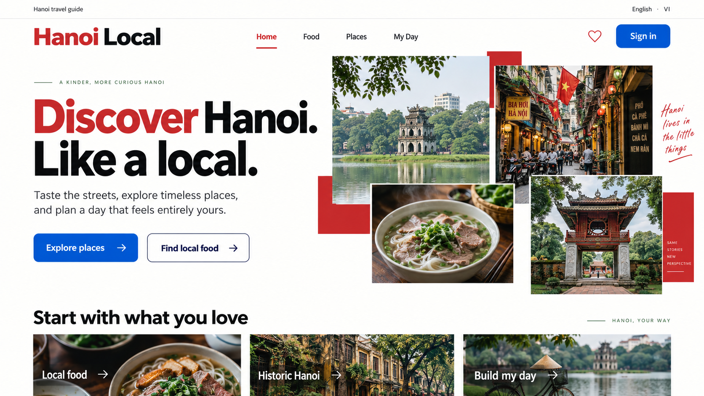

# Hanoi Local — Final Project Web Dev Application

**Group 33**

1. Vu Quang Huy
2. Nguyen Khac Hung
3. Bui Viet Hoang
4. Nguyen Ba Khoa
5. Nghiem Trong Quoc Anh

## Project handoff

Thư mục này là nguồn tài liệu thống nhất cho final project website hướng dẫn du lịch Hà Nội.

## Quyết định đã chốt

- Tên sản phẩm: **Hanoi Local**.
- Frontend: HTML, CSS và JavaScript thuần.
- Backend: Node.js + Express.
- Database: SQLite.
- Ngôn ngữ bản nộp: English.
- Song ngữ Việt–Anh: chuyển sang Future Development.
- Phạm vi chính: Home, Food, Places, Account, Favorites và My Day.
- Phong cách: editorial city guide, lấy cảm hứng từ nhịp bố cục của I amsterdam nhưng không sao chép thương hiệu.

## Chạy dự án

Yêu cầu: Node.js 22.5 trở lên (SQLite dùng module `node:sqlite` có sẵn trong Node, không cần build native).

    npm install
    cp .env.example .env      # tuỳ chọn, app vẫn chạy với giá trị mặc định
    npm run db:reset          # tạo schema + seed 10 Food và 10 Places
    npm start                 # http://localhost:3000

Script khác:

| Script | Việc nó làm |
|---|---|
| `npm run dev` | Chạy server với `--watch`, tự restart khi sửa file |
| `npm run db:init` | Áp schema, chạy lại nhiều lần vẫn an toàn |
| `npm run db:seed` | Seed lại 20 spot bằng upsert, không nhân đôi và không xoá dữ liệu user |
| `npm run db:reset` | Xoá file database rồi tạo lại từ đầu |
| `npm run db:demo` | Tạo 2 account demo kèm favorites và My Day mẫu, chạy lại được |
| `npm run db:demo-reset` | Database sạch + account demo, dùng trước khi thuyết trình |
| `npm run qa` | Chạy toàn bộ 8 bộ kiểm tra bên dưới (khoảng 4–5 phút) |
| `npm run qa:responsive` | Tràn ngang + console error ở 375/768/1024/1440 cho 4 trang |
| `npm run qa:catalogue` | Search/filter/sort/modal/guest prompt |
| `npm run qa:auth` | Endpoint auth + bằng chứng trong database + middleware requireAuth |
| `npm run qa:account` | Form register/login, header auth state, session qua reload |
| `npm run qa:data` | Favorites + itinerary API, hai account song song, ownership, totals |
| `npm run qa:drawers` | Hai drawer trong browser: đồng bộ tim, move/remove/reset, logout |
| `npm run qa:a11y` | Contrast, touch target, label, heading, đường đi bàn phím |
| `npm run qa:perf` | Lazy load, layout shift, hiệu quả render, đếm ảnh còn thiếu |
| `npm run benchmark` | Đo API ở 1/20/50 concurrent, in ra bảng markdown |
| `npm run assets:webp <thư-mục>` | Convert ảnh gốc sang AVIF/WebP + in bảng before/after |

Các script `qa:*` cần server đang chạy ở cổng 3000 và cần Chrome cài trên máy. Hiện tại: **343 assertion pass, 0 fail**.

**Lưu ý:** đừng chạy `db:reset` hay `db:demo-reset` khi server đang chạy. Script sẽ tự chặn và báo lỗi, vì xoá file database lúc server còn giữ nó sẽ khiến server ghi tiếp vào file đã bị unlink, và mọi process khác đọc ra database rỗng.

### Account demo

    npm run db:demo-reset

Tạo `demo / hanoi2026` (4 favorites, 5 stop) và `demo2 / hanoi2026` (2 favorites, 3 stop). Hai account có dữ liệu khác nhau để chứng minh dữ liệu là riêng theo user mà không phải đăng ký trực tiếp trên sân khấu.

Password này nằm trong repo có chủ ý, vì `docs/05` yêu cầu presenter có credential biết trước. Hai lớp chặn để nó không thành lỗ hổng thật: script **từ chối chạy** khi `NODE_ENV=production`, và có thể đổi bằng `DEMO_PASSWORD=... npm run db:demo`.

## Trạng thái triển khai

| Phase | Nội dung | Tình trạng |
|---|---|---|
| 0 | Express skeleton, schema SQLite, seed 20 spot, `GET /api/spots`, design tokens | Xong, Gate 0 pass |
| 1 | Shared UI, Home, Food, Places, detail modal | Xong, Gate 1 pass |
| 2 | Authentication: register/login/logout, session lưu trong SQLite | Xong, Gate 2 pass |
| 3 | Favorites và My Day, hai drawer, totals | Xong, Gate 3 pass |
| 4 | QA, accessibility, benchmark, demo data, setup | Xong phần code; còn ảnh thật và slide |

### Bản đồ file frontend

| File | Trách nhiệm |
|---|---|
| `css/tokens.css` | Design token, không hardcode màu/size ở nơi khác |
| `css/fonts.css` | @font-face Archivo + Manrope self-host |
| `css/base.css` | Reset, typography, layout primitive, focus, skip link |
| `css/components.css` | Button, card, chip, field, header, footer, modal, drawer, toast |
| `css/pages.css` | Style theo trang, scope dưới class của trang |
| `js/api.js` | Fetch wrapper duy nhất, chuẩn hoá lỗi, không chạm DOM |
| `js/cards.js` | Render card + skeleton từ data, không tự fetch |
| `js/filters.js` | Filter state, search/filter/sort, hàm thuần không mutate mảng gốc |
| `js/modal.js` | Dialog/drawer trên `<dialog>` native, detail modal dùng chung |
| `js/layout.js` | Header, mobile menu, sticky, toast, login prompt |
| `js/auth.js` | User hiện tại, register/login/logout, cập nhật header auth state |
| `js/favorites.js` | Set id đã lưu, đồng bộ mọi nút tim, Favorites drawer |
| `js/itinerary.js` | My Day: add theo slot, move, remove, reset, totals, slot picker |
| `js/home.js` | Trang Home |
| `js/catalogue.js` | Dùng chung cho Food và Places, chọn bằng `<main data-kind>` |
| `js/account.js` | Trang account: validate form, inline error, show/hide password |

### Estimated cost của My Day

Place có `admission` là số VND thật. Food chỉ có `priceLevel` 1–3 vì một bát phở không có một giá cố định, nên `server/services/pricing.js` quy đổi thành số đại diện:

| priceLevel | Mức | Quy đổi |
|---|---|---:|
| 1 | Quán đường phố, một món | 50.000 VND |
| 2 | Quán ngồi bình dân | 150.000 VND |
| 3 | Nhà hàng đặc sản | 300.000 VND |

Đây là giả định của nhóm, không phải số liệu từ nguồn nào, nên nó nằm ở đúng một bảng export để sửa một chỗ là đổi hết. Drawer luôn ghi "about" và có dòng nói rõ phần vé tham quan là số chính xác còn phần ăn uống là ước lượng từ price level, để không trình bày con số như thể nó tuyệt đối.

### Bảo mật auth (Phase 2)

- Password hash bằng bcrypt cost 10 trước khi insert; `password_hash` không bao giờ ra khỏi `users.service.js`.
- Login sai trả đúng một câu chung "Incorrect username or password." cho cả trường hợp sai user và sai password, nên không thể dò xem username nào tồn tại. Khi không tìm thấy user, code vẫn chạy `bcrypt.compare` với một hash giả để thời gian phản hồi không tố cáo.
- Session chỉ chứa `userId`; mọi thông tin user khác đọc lại từ database mỗi request.
- `req.session.regenerate()` khi login để chống session fixation.
- Cookie `hanoi.sid`: `httpOnly`, `sameSite=lax`, `secure` khi `NODE_ENV=production`, TTL 7 ngày, `rolling: true`.
- Server **từ chối khởi động** khi `NODE_ENV=production` mà `SESSION_SECRET` vẫn là giá trị mặc định.
- Route cần đăng nhập dùng chung middleware `requireAuth`; `user_id` luôn lấy từ session, không bao giờ nhận từ body hay query.

### Dữ liệu cá nhân (Phase 3)

- Toàn bộ route `/api/favorites` và `/api/itinerary` nằm sau `requireAuth`, guest nhận 401 chứ không nhận danh sách rỗng.
- Chống trùng nằm ở schema, không ở code: `PRIMARY KEY (user_id, spot_id)` cho favorites và `UNIQUE (user_id, spot_id)` cho itinerary.
- Sửa hoặc xoá item của người khác trả **404 chứ không phải 403**, để một account không thể dò xem id nào thuộc về ai.
- Position trong mỗi slot luôn là dãy liền 0..n-1; mọi lần move đều renumber trong transaction, nên thứ tự sau reload luôn đúng.
- Reset cần hai lớp xác nhận: UI hỏi lại trước, và endpoint vẫn đòi `{ "confirm": true }`.
- Đổi thứ tự dùng nút lên/xuống thay vì drag & drop, đúng như fallback đã ghi trong risk register, và tự nhiên dùng được bằng bàn phím.

### Session store tự viết

`server/db/session-store.js` là một `express-session.Store` lưu session vào bảng `sessions` trong SQLite. Lý do không dùng MemoryStore mặc định: restart server là mất hết session và express-session cảnh báo không dùng cho production. Lý do không dùng package: các store SQLite có sẵn kéo theo native module.

Store cài `get`/`set`/`destroy`/`touch`/`length`/`all`/`clear`, tự xoá session hết hạn khi khởi động và mỗi giờ sau đó. Đã verify session sống qua restart server.

### Ảnh còn thiếu (task PERF-01)

24 ảnh chưa có. Server đang trả `placeholder.svg` kèm header `X-Image-Placeholder: true` nên layout không vỡ và `npm run qa:perf` đếm được còn thiếu bao nhiêu.

Ứng dụng tham chiếu ảnh **không có đuôi file**, ví dụ `/assets/images/spots/food-pho-bo`. `server/middleware/images.js` tự chọn định dạng nào có trên đĩa theo thứ tự `.avif` → `.webp` → `.jpg` → `.png`. Nghĩa là nhóm dùng AVIF hay WebP đều được, không phải sửa code.

Cách làm:

1. Đặt ảnh gốc vào một thư mục, đặt tên theo tiền tố:
   - `food-<id>.jpg` và `place-<id>.jpg` — 20 file, id lấy trong `server/db/seed-data.js`, tỉ lệ 4:3
   - `hero-hoan-kiem-lake.jpg` (4:3), `hero-old-quarter-street.jpg` (3:4), `hero-street-food.jpg` (4:3), `hero-temple-of-literature.jpg` (4:3)
   - `tile-local-food.jpg`, `tile-historic-hanoi.jpg`, `tile-build-my-day.jpg` (16:9)
2. Chạy `npm run assets:webp <thư-mục>`. Script convert, resize theo vai trò (hero 1600px, còn lại 1200px), đặt vào đúng chỗ và in bảng before/after để dán vào `docs/05`.
3. Chạy `npm run qa:perf` để xác nhận không còn ảnh nào fallback.

Script dùng `cwebp` nếu có (`brew install webp`), nếu không thì dùng `sips` có sẵn trên macOS và xuất AVIF. Trên macOS 26, `sips` đọc được WebP nhưng không ghi được, nên AVIF là mặc định.

Nhớ ghi nguồn ảnh và giấy phép vào slide.

### Ghi chú kỹ thuật so với Technical Spec

- Database driver: `node:sqlite` built-in thay vì `better-sqlite3`, để `npm install` không phải compile native module trên máy từng thành viên.
- Password hashing dùng `bcryptjs` (pure JS) thay `bcrypt`, cùng lý do không compile native. Technical Spec ghi "bcrypt-compatible package" nên vẫn đúng spec.
- `GET /api/auth/me` trả 200 với `user: null` cho guest thay vì 401, vì frontend gọi nó ở mọi lần load trang để dựng header, và guest xem catalogue công khai không phải là lỗi.
- Biến môi trường: dùng `process.loadEnvFile()` của Node thay vì package `dotenv`.
- Ảnh spot trỏ tới `/assets/images/spots/<id>.webp`. Ảnh thật sẽ được thêm ở task PERF-01; trước đó `cards.js` tự fallback sang `placeholder.svg` nên layout không vỡ.
- Header và footer là markup tĩnh lặp lại trong từng file HTML, không inject bằng JS, để navigation vẫn dùng được khi JS lỗi. Đổi header thì phải sửa cả `index.html`, `food.html`, `places.html` (và `account.html` khi có).
- Thêm hai module ngoài danh sách trong Technical Spec: `layout.js` (hành vi shell) và `catalogue.js` (dùng chung cho Food/Places). Font tự host thay vì gọi Google Fonts CDN để demo chạy được khi không có mạng.
- Modal và drawer dựng trên `<dialog>` native (`showModal`), nên focus trap, Escape và `::backdrop` là hành vi sẵn có của browser thay vì tự viết.

## Tài liệu

1. [Design Style](docs/01-design-style.md) — màu sắc, typography, layout, component và responsive rules.
2. [Product Spec](docs/02-product-spec.md) — phạm vi, user flow, tính năng và acceptance criteria.
3. [Technical Spec](docs/03-technical-spec.md) — kiến trúc, database, API và quy tắc backend.
4. [Task Breakdown](docs/04-task-breakdown.md) — chia việc tối đa 7 thành viên, dependency và Definition of Done.
5. [Testing and Scoring](docs/05-testing-and-scoring.md) — test matrix, tối ưu, benchmark và kịch bản thuyết trình.

## Ảnh thiết kế tham chiếu

Ảnh mockup dùng để thống nhất hướng thẩm mỹ. Khi code, ưu tiên tính responsive, accessibility và khả năng giải thích hơn việc khớp từng pixel.

## Thứ tự bắt đầu

1. Cả nhóm đọc Product Spec và chốt dữ liệu 10 Food + 10 Places.
2. Thành viên phụ trách kiến trúc tạo project skeleton và database schema.
3. Thành viên UI tạo design tokens và shared components.
4. Food, Places và backend auth có thể triển khai song song.
5. Favorites và My Day chỉ bắt đầu sau khi auth/session chạy ổn định.
6. QA tích hợp sớm, không đợi đến ngày cuối.
