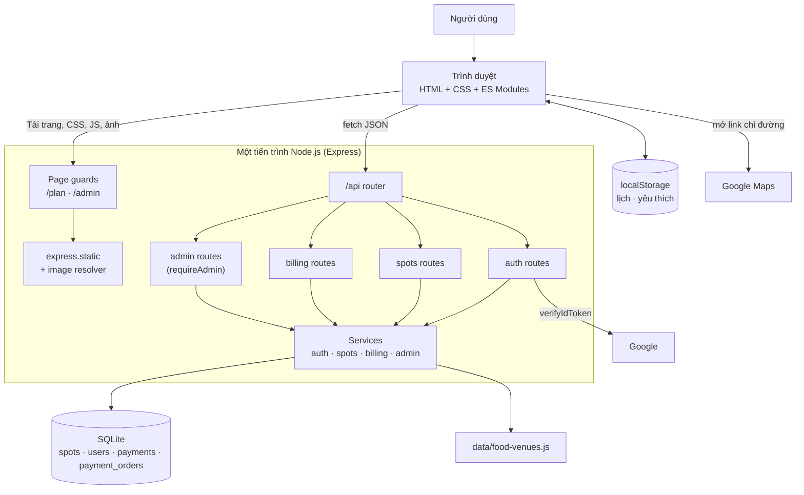

# Hanoi Local

Website hướng dẫn khám phá Hà Nội — đồ án cuối kỳ môn Web Application (USTH, Nhóm 33). Người dùng có thể tìm món ăn và quán cụ thể, xem địa điểm tham quan, rồi lập lịch trình 1–30 ngày ngay trong trình duyệt.

## Mục lục

- [Tính năng](#tính-năng)
- [Công nghệ](#công-nghệ)
- [Kiến trúc](#kiến-trúc)
- [Cấu trúc thư mục](#cấu-trúc-thư-mục)
- [Cơ sở dữ liệu](#cơ-sở-dữ-liệu)
- [API](#api)
- [Xác thực và bảo mật](#xác-thực-và-bảo-mật)
- [Hiệu năng](#hiệu-năng)
- [Cài đặt và chạy](#cài-đặt-và-chạy)
- [Biến môi trường](#biến-môi-trường)
- [Kiểm thử](#kiểm-thử)
- [Hạn chế đã biết](#hạn-chế-đã-biết)

## Tính năng

| Trang | Chức năng |
|---|---|
| **Home** (`index.html`) | Giới thiệu Hà Nội và các tour mẫu. |
| **Eat & drink** (`food.html`) | 10 món, mỗi món có ít nhất 2 quán; xếp quán theo khoảng cách ước tính từ mốc xuất phát; lưu món yêu thích. |
| **See & do** (`places.html`) | Tìm điểm tham quan, xem thời lượng và giá vé, thêm vào lịch. |
| **Plan your day** (`plan.html`) | Lịch 1–30 ngày; tour mẫu; sắp xếp lại điểm dừng, ghim giờ, Optimise order, Nearby ideas; mở tuyến trong Google Maps; lưu lịch có tên và tour tự tạo. Chia sẻ bằng link, in lịch và xuất `.ics` chỉ dành cho **Premium**. |
| **Tài khoản** (`login.html`) | Đăng ký/đăng nhập bằng email + mật khẩu hoặc Google. Trang Plan yêu cầu đăng nhập. |
| **Premium** (`upgrade.html`, `pay.html`) | Nâng cấp gói bằng QR (thanh toán **giả lập**, không có tiền thật). Gói free: tối đa 3 ngày và 1 lịch có tên; Premium: 30 ngày, 10 lịch, chia sẻ/in/`.ics`. Các giới hạn này chỉ kiểm tra ở trình duyệt. |
| **Admin** (`admin.html`) | Quản lý người dùng (đổi gói, xoá) và CRUD danh mục món/địa điểm. Chỉ tài khoản admin. |

## Công nghệ

| Lớp | Công nghệ |
|---|---|
| Frontend | HTML, CSS, JavaScript ES Modules thuần (không framework) |
| Backend | Node.js ≥ 22.5, Express 5 |
| Database | SQLite qua `node:sqlite` (API tích hợp sẵn của Node) |
| Đăng nhập Google | `google-auth-library` (xác minh ID token phía server) |
| Mã QR | `qrcode` |
| Lưu trữ phía client | `localStorage` (lịch, món yêu thích, thư viện cá nhân) |
| Bản đồ | Chỉ tạo URL Google Maps — không cần API key |

## Kiến trúc

### Tổng quan

Mô hình **client–server**, frontend dạng **multi-page application**: mỗi trang là một file HTML riêng, JavaScript bên trong cập nhật DOM động. Một tiến trình Node.js phục vụ cả API lẫn file tĩnh trên cùng một cổng; SQLite là file được mở trực tiếp bởi tiến trình đó. Ba phần giao diện / xử lý / dữ liệu là các **lớp logic**, không phải ba dịch vụ triển khai riêng.



### Backend: ba tầng

```
Request → Router → Service → SQLite → JSON
            │         │
            │         └─ nghiệp vụ, validate, truy vấn (prepared statements)
            └─ nhận HTTP, gọi service, định dạng phản hồi
```

| Tầng | Thư mục | Trách nhiệm |
|---|---|---|
| Entry point | `server.js` | Khởi tạo DB, gắn middleware, phục vụ API trước rồi file tĩnh, tắt server gọn khi nhận SIGINT/SIGTERM. |
| Routes | `routes/` | Ánh xạ URL → hàm service; áp `requireUser` / `requireAdmin`. |
| Services | `services/` | Logic nghiệp vụ: băm mật khẩu, phiên, đọc/ghi SQLite, tạo đơn thanh toán. |
| Middleware | `middleware/` | Phân quyền, xử lý lỗi thống nhất (`ApiError`), chọn định dạng ảnh. |
| Database | `database/` | Kết nối, schema, khởi tạo, seed. |
| Config | `config/environment.js` | Đọc biến môi trường. |

Thứ tự xử lý request trong `server.js`: `/api` → `apiNotFound` → page guards (`/plan`, `/admin`) → `resolveImage` → `express.static` → `errorHandler`.

### Frontend: chia theo trang và module dùng chung

```
scripts/
  pages/    Một file khởi tạo cho mỗi trang (home, food, places, plan, login, upgrade, pay, admin)
  shared/   Module dùng lại
    guide.js          mốc xuất phát, khoảng cách ước tính, link Maps, localStorage
    tours.js          tour mẫu
    schedule.js       thuật toán xếp giờ theo buổi sáng/chiều/tối
    plan-controls.js  điều khiển lịch (xoá, xác nhận, dời điểm dừng)
    library.js        lịch/tour đã lưu
    share.js          mã hoá lịch vào URL (#plan=…)
    calendar.js       xuất file .ics
    auth.js           trạng thái đăng nhập, nút Google Sign-In
    ui.js             tạo DOM an toàn bằng textContent, ảnh lazy-load
```

### Các luồng chính

**1. Tải danh mục** — trang gọi `GET /api/spots` → `spots.routes` → `spots.service` đọc bảng `spots` và ghép quán từ `food-venues.js` → JSON → trang render bằng `textContent`.

**2. Đăng nhập email** — `POST /api/auth/login` → kiểm tra giới hạn thử sai → verify scrypt → server đặt cookie `hl_session` (`httpOnly`) → các request sau mang cookie, `currentUser(req)` xác minh chữ ký + hạn.

**3. Đăng nhập Google** — Google Identity Services trả ID token cho trình duyệt → `POST /api/auth/google` → server xác minh chữ ký/audience/email → tạo hoặc liên kết tài khoản theo `google_sub`/email → đặt cookie phiên.

**4. Nâng cấp Premium (giả lập)**
```
Upgrade → POST /billing/orders (tạo đơn, code 96-bit, hạn 10 phút)
       → hiện QR trỏ tới /pay.html?order=<code>
       → điện thoại quét, pay.html gọi POST /billing/pay/:code
       → server đánh dấu đơn paid + nâng plan = premium
       → Upgrade hỏi lại trạng thái đơn và tự cập nhật
```

**5. Lập lịch** — chủ yếu chạy hoàn toàn ở trình duyệt: dữ liệu lịch nằm trong `localStorage`; chia sẻ bằng link đặt lịch trong phần `#plan=` của URL (không qua server); `.ics` được tạo phía client.

**6. Quán gần** — web tính khoảng cách đường chim bay ước tính từ mốc xuất phát và xếp quán gần lên trước. Đây chỉ là thứ tự gợi ý; nút **Directions** mở Google Maps để xem đường đi thực tế. Giờ xếp lịch: sáng từ 08:00, chiều từ 12:00, tối từ 18:00, đệm 15–30 phút giữa các điểm.

## Cấu trúc thư mục

```text
.
├── source/
│   ├── frontend/public/
│   │   ├── *.html              Các trang
│   │   ├── scripts/pages/      JS riêng từng trang
│   │   ├── scripts/shared/     Module dùng chung
│   │   ├── styles/             CSS (tokens, base, từng trang)
│   │   └── assets/             Ảnh (WebP/AVIF) và font
│   └── backend/
│       ├── src/
│       │   ├── server.js
│       │   ├── config/         Biến môi trường
│       │   ├── routes/         api, auth, spots, billing, admin
│       │   ├── services/       auth, spots, billing, admin
│       │   ├── middleware/     auth, error-handler, image-resolver
│       │   ├── database/       connection, schema.sql, initialize, seed
│       │   ├── data/           Dữ liệu quán ăn
│       │   └── utils/          ApiError, helper phản hồi
│       └── data/               File SQLite local (không commit)
├── tests/                      Kiểm thử
├── scripts/                    Benchmark, tối ưu ảnh, import dữ liệu
├── .env.example
└── package.json
```

## Cơ sở dữ liệu

SQLite, bật `foreign_keys` và chế độ WAL.

| Bảng | Nội dung chính |
|---|---|
| `spots` | Món ăn và địa điểm (`kind`), tọa độ, thời lượng, `featured`. Có index theo `kind` và `featured`. |
| `users` | `email` (duy nhất), `google_sub`, `password_hash` (rỗng nếu chỉ dùng Google), `role` (`user`/`admin`), `plan` (`free`/`premium`). |
| `payments` | Lịch sử nâng cấp (giả lập, `method = 'demo'`). |
| `payment_orders` | Đơn chờ thanh toán: `code` duy nhất, `status` (`pending`/`paid`), `expires_at`. |

`db:init` chỉ tạo bảng còn thiếu và migrate cột mới; `db:seed` cập nhật danh mục bằng upsert.

## API

Tiền tố `/api`. Body JSON giới hạn 20 KB.

| Method | Đường dẫn | Quyền | Mô tả |
|---|---|---|---|
| GET | `/health` | — | Kiểm tra server. |
| GET | `/spots`, `/spots/:id` | — | Danh mục món/địa điểm. |
| GET | `/auth/config` | — | Cấu hình đăng nhập Google cho frontend. |
| GET | `/auth/me` | — | Người dùng hiện tại. |
| POST | `/auth/register`, `/auth/login`, `/auth/google`, `/auth/logout` | — | Đăng ký / đăng nhập / đăng xuất. |
| GET | `/billing/plans` | — | Các gói. |
| POST | `/billing/orders` | Đăng nhập | Tạo đơn nâng cấp. |
| GET | `/billing/orders/:code` | Đăng nhập | Trạng thái đơn. |
| GET | `/billing/orders/:code/qr.svg` | — | Ảnh QR. |
| GET/POST | `/billing/pay/:code` | — (code là bí mật) | "Ngân hàng" giả lập xác nhận. |
| GET/PATCH/DELETE | `/admin/users[/:id]` | Admin | Quản lý người dùng. |
| GET/POST/PUT/DELETE | `/admin/spots[/:id]` | Admin | CRUD danh mục. |

Trang `/plan` yêu cầu đăng nhập, `/admin` yêu cầu quyền admin; chưa đủ quyền sẽ bị chuyển hướng.

## Xác thực và bảo mật

**Đã có**

- Mật khẩu băm **scrypt** có salt, so sánh bằng `timingSafeEqual`.
- Phiên là cookie ký **HMAC-SHA256** (`userId.hạn.chữ ký`), hạn 7 ngày; cookie `httpOnly`, `sameSite=lax`, `secure` ở production.
- Giới hạn đăng nhập sai: 8 lần / 15 phút theo IP + email; thông báo lỗi giống nhau cho mọi trường hợp.
- Xác minh Google ID token (chữ ký, audience, email đã xác minh).
- Phân quyền theo route (`requireUser`, `requireAdmin`) và theo trang.
- Chống SQL injection: toàn bộ truy vấn dùng prepared statements.
- Chống XSS: frontend không dùng `innerHTML`, dữ liệu hiển thị bằng `textContent`.
- Validate đầu vào; link ngoài có `rel="noopener noreferrer"`; tắt `x-powered-by`.
- `.env` và file `.sqlite` nằm trong `.gitignore`.

**Chưa có (hướng phát triển)**: security headers (`helmet`/CSP), rate limit toàn cục, token CSRF, thu hồi phiên phía server, HTTPS/HSTS khi deploy.

## Hiệu năng

- Ảnh danh mục tạo bằng `picture()` có `loading="lazy"` kèm `width`/`height` để tránh layout shift.
- Ảnh hero dùng `fetchpriority="high"`; font `preload`.
- Ảnh được chuyển sang WebP/AVIF (`npm run assets:webp`); `image-resolver` chọn định dạng có sẵn.
- Script Google Sign-In chỉ nạp khi cần.
- File tĩnh cache 1 giờ ở production; trang cần đăng nhập dùng `Cache-Control: private, no-cache`.

## Cài đặt và chạy

Cần **Node.js 22.5+**.

```sh
npm ci
cp .env.example .env     # rồi điền các giá trị cần thiết
npm run db:init
npm run db:seed
npm start
```

Mở <http://localhost:3000>. Dùng `npm run dev` để server tự khởi động lại khi sửa backend.

| Lệnh | Tác dụng |
|---|---|
| `npm start` / `npm run dev` | Chạy server (dev có `--watch`). |
| `npm run db:init` | Tạo bảng còn thiếu. |
| `npm run db:seed` | Cập nhật danh mục (upsert). |
| `npm run db:reset` | Xoá và tạo lại DB, rồi seed. **Mất dữ liệu.** |
| `npm run qa` | Chạy toàn bộ kiểm thử. |
| `npm run benchmark` | Đo các API GET trên máy local. |
| `npm run assets:webp` | Tối ưu ảnh sang WebP. |

## Biến môi trường

| Biến | Ý nghĩa |
|---|---|
| `PORT` | Cổng server (mặc định 3000). |
| `DATABASE_PATH` | Đường dẫn file SQLite (mặc định `./source/backend/data/hanoi-local.sqlite`). |
| `NODE_ENV` | `production` bật cookie `secure` và cache tĩnh. |
| `GOOGLE_CLIENT_ID` | OAuth client ID cho đăng nhập Google. |
| `SESSION_SECRET` | Chuỗi ngẫu nhiên dài để ký cookie. Đổi giá trị sẽ làm mọi phiên hết hiệu lực. |
| `ADMIN_EMAILS` | Email admin, cách nhau bằng dấu phẩy; tự thành admin khi đăng nhập. |
| `PUBLIC_URL` | Địa chỉ công khai để nhúng vào mã QR (mặc định dùng IP LAN). |

Không bao giờ commit file `.env`.

## Kiểm thử

Chạy server trước, sau đó `npm run qa` gồm:

- `qa:structure` — kiểm tra đường dẫn và cấu trúc source.
- `qa:schedule` — thuật toán xếp giờ.
- `qa:guide` — luồng Home → món/quán → tour.
- `qa:plan` — luồng lịch nhiều ngày bằng Chrome.

## Hạn chế đã biết

- Khoảng cách là **ước tính đường chim bay**, không phải định tuyến thời gian thực; giờ mở cửa cần kiểm tra lại trên Google Maps.
- Thanh toán Premium chỉ là giả lập.
- Lịch và món yêu thích nằm trong `localStorage`, không tự đồng bộ giữa các thiết bị.
- Giao diện thiết kế cho desktop, không hỗ trợ điện thoại.
- Bộ đếm đăng nhập sai nằm trong RAM, mất khi restart.
- Xem thêm [KIEN_TRUC_VA_LUONG_HE_THONG.md](KIEN_TRUC_VA_LUONG_HE_THONG.md) và [HUONG_DAN_THUYET_TRINH.md](HUONG_DAN_THUYET_TRINH.md) để biết chi tiết kiến trúc và kịch bản demo.
